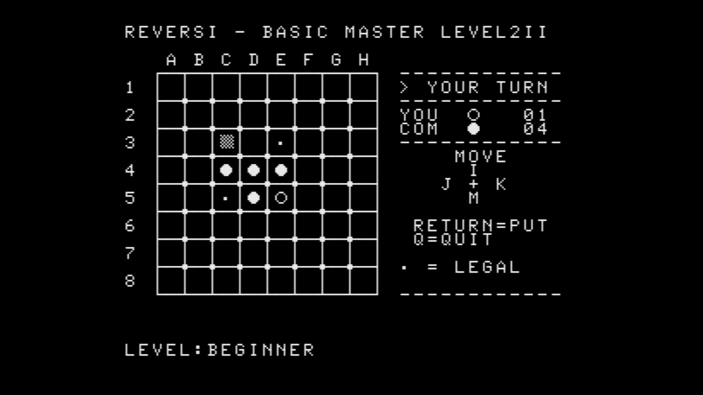
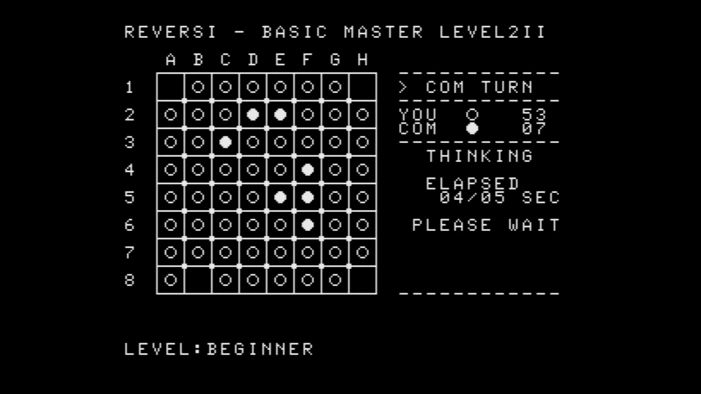

# REVERSI - BASIC MASTER LEVEL2II

**REVERSI - BASIC MASTER LEVEL2II** は、Hitachi BASIC MASTER LEVEL2II（MB-6881）向けのリバーシです。
Hitachi HD46800 8ビットMPU向けに作成しており、16KB RAM環境で動作します。HD46800はMotorola MC6800と命令セット互換です。

**Version 1.0 — 初回公開版**

英語版：[README.md](README.md)

## 特徴

- 8×8 リバーシ
- 先手 / 後手の選択
- 3段階のCOM強さ
- 合法手マーカーと点滅カーソル
- `I / J / K / M` によるカーソル移動
- 手番、石数、COM思考時間の表示
- Negamax + alpha-beta pruningによる探索
- 位置評価とmobility評価
- 終盤の完全探索
- パス処理

## スクリーンショット

### 人間の手番
石を置ける場所を `・` で表示し、選択中の合法手を点滅カーソルで示します。

### COMの思考中
COMの手番では、経過時間と最大思考時間を表示します。

## 対象機種

- Hitachi BASIC MASTER LEVEL2II（MB-6881）
- Hitachi HD46800（MC6800互換）
- 16KB RAM
- ロード / 実行開始アドレス：`$1000`
- 文字VRAM：`$0100-$03FF`（32 × 24）

## 実行

`bin/` には次のファイルを収録しています。

- `reversi6800_BM_L2II_v1.0.bin` — raw binary
- `reversi6800_BM_L2II_v1.0.s19` — Motorola S-record

raw BINは`$1000`にロードし、`$1000`から実行してください。
S-recordにはロードアドレスが含まれており、実行開始アドレスは`$1000`です。

詳しい遊び方は [docs/PLAYING_GUIDE-J.md](docs/PLAYING_GUIDE-J.md) を参照してください。

## 著作権

Copyright (C) 2026 Haku Soft Works. All rights reserved.

権利関係については [COPYRIGHT.txt](COPYRIGHT.txt) および [NOTICE.md](NOTICE.md) を参照してください。
